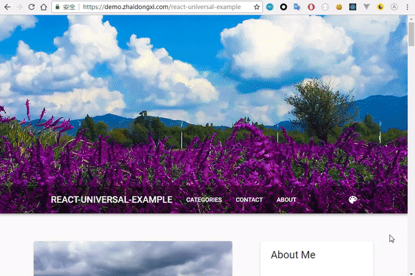

# react-universal-example

<p align="center">
  <a href="https://demo.zhaidongxi.com/react-universal-example/" target="_blank">
    
  </a>
</p>

这是一个[React](https://github.com/facebook/react)应用的例子，基于[react-starter-kit](https://github.com/kriasoft/react-starter-kit/tree/feature/redux)开发

在线 [Demo](https://demo.zhaidongxi.com/react-universal-example/)

相比于`react-starter-kit`，本应用包含以下特点:

- Google [材料](https://github.com/mui-org/material-ui) 设计
- Jss([Css in Js](http://cssinjs.org/)) 主题
- 使用 Sass 语法书写 PostCss ([precss](https://github.com/jonathantneal/precss))
- 支持相对路径 (`APP_BASE_URL`)
- 更合理的 Webpack 配置
- 移除没有使用过的依赖

## Quick Start

```
git clone https://github.com/daixianceng/react-universal-example.git
cd react-universal-example

# 拷贝默认配置
cp .env.example .env

# 安装依赖
npm install
# 或
yarn

# 在开发环境下启动应用
npm start
# 或
yarn start
```

现在你可以在浏览器中打开`localhost:3000`开始体验。项目依赖于[yii2-app-example](https://github.com/daixianceng/yii2-app-example)的 API，这是一个干净、漂亮的 RESTful API，你一定会爱上它。项目有一个默认指向`https://demo.zhaidongxi.com/yii2-app-example-api`的 API 地址，所以你不需要安装`yii2-app-example`。

编译项目：

```
npm run build -- --release
# 或
yarn build -- --release
```

启动：

```
npm run serve
# 或
yarn serve

# 或者使用pm2启动守护进程（首先：npm i pm2 -g）
npm run pm2-serve
# 或
yarn pm2-serve
```

更多文档请移步[getting started guide](https://github.com/kriasoft/react-starter-kit/blob/feature/redux/docs/getting-started.md)

## License

**react-universal-example** 使用 FSB 许可证发布。详情请进入 `LICENSE` 查看。
